## 1. Building the WRF Core

WRF软件包：


文件夹dyn_em: 求解**真实大气**的动力学过程


```shell
./clean -a  # 清除编译后的可执行文件，保留源程序
```

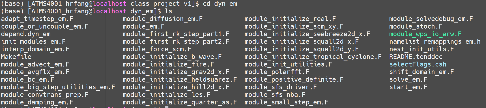

```shell
vi ~/.bashrc
source ~/.bashrc	# 配置运行环境
```

在WRF母文件夹内：

```shell
./configure
```

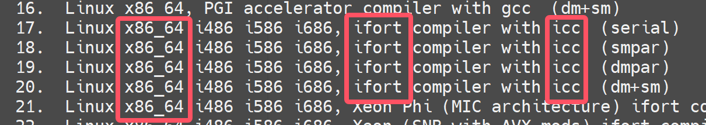

serial: 串行

smpar: 共享内存(sm)并行(par)策略

dmpar: 分散内存(dm)并行(par)策略

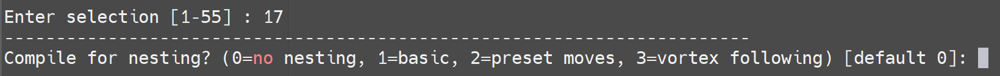

（这里选择1.basic）产生configure.wrf*

> [!CAUTION]
>
> 生成后还需要进一步调整部分参数以适配服务器

选择编译器（真实大气）


运行后，会出现.exe可执行文件

```shell
ls -ls main/*.exe
```

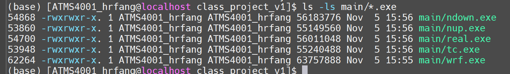

## 2.Building the WPS Code

> [!CAUTION]
>
> building WPS requires that WRF being already built!

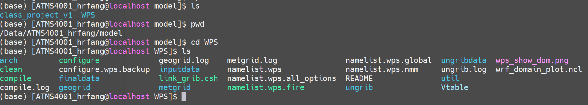

同样地，

```shell
./clean -a  # 清除编译后的可执行文件，保留源程序

./configure	# 选择17编译器，注意WRF_DIR等参数
# cp */configure.wps ./

./compile	# 编译
```

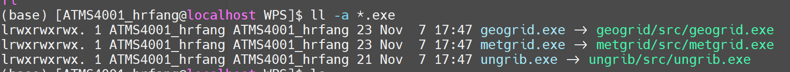

geogrid.exe: 积分所用的区域，陆面信息

ungrib.exe: 观测 -> 网格数据解析

metgrid.exe: 插值

**对应Step1-3.**

测试区域网格：
```shell
vim namelist.wps	# 设置中心坐标、其他

ncl wrf_domain_plot.ncl	# 生成wps_show_dom.png
```


```shell
&share
 wrf_core = 'ARW',
 max_dom = 1,	# dom层数
 start_date = '2018-08-01_00:00:00', '2018-08-01_00:00:00'
 end_date   = '2018-08-05_00:00:00', '2018-08-05_00:00:00'
 interval_seconds = 10800	# 对时间插值，需要时刻的初始场
 io_form_geogrid = 2,
/

&geogrid
 parent_id         =   1, 1		# 母区域驱动
 parent_grid_ratio =   1, 5		# 内网格和外网格的分辨率之比
 i_parent_start    =   1, 31	# 在单区域中，start from 1
 j_parent_start    =   1, 31	# 在多区域嵌套中，从左下角开始
 e_we              =  361, 101	# 东西方向的网格**边界**数，n网格->(n+1)边界
 e_sn              =  131, 101	# 南北方向的网格**边界**数
...
 dx = 1.0,
 dy = 1.0,	# 模式的分辨率（保持正方形）
 map_proj = 'lat-lon',	# 在lat-lon投影下dx、dy的单位为度，在其他（包括Lambert）投影下单位为米
 ref_lat   =  31.8,
 ref_lon   =  117.2,	# 中心经纬度的网格
 pole_lat = 90 ,
 pole_lon = 180,
 stand_lon =  117.2,	# 与ref_lon一致

```

Lambert投影：

```shell
&geogrid
 parent_id         =   1, 1
 parent_grid_ratio =   1, 5
 i_parent_start    =   1, 31
 j_parent_start    =   1, 31
 e_we              =  30, 101
 e_sn              =  30, 101
 !

 dx = 300000.0,
 dy = 300000.0,
 map_proj = 'lambert',
 ref_lat   =  31.8,
 ref_lon   =  117.2,
 truelat1 = 30.0 ,
 truelat2 = 60.0,
 stand_lon =  117.2,	# 做截面的起始维度

```


```shell
&ungrib
 out_format = 'WPS',
 prefix = 'ungribdata/FNL',
/

```

```shell
&metgrid
 fg_name = 'ungribdata/FNL'
 io_form_metgrid = 2,
 opt_output_from_metgrid_path='finaldata/'
/
       
```

### 2.1 Runing the geogrid.exe

```shell
./geogrid.exe > geogrid.log &
```

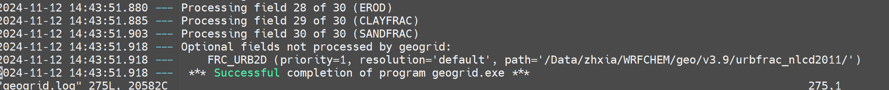

产生*.nc文件：

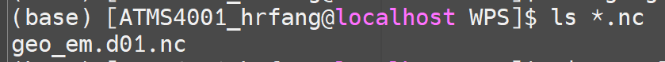

```shell
ncview geo_em.d01.nc &	# 查看.nc文件
```

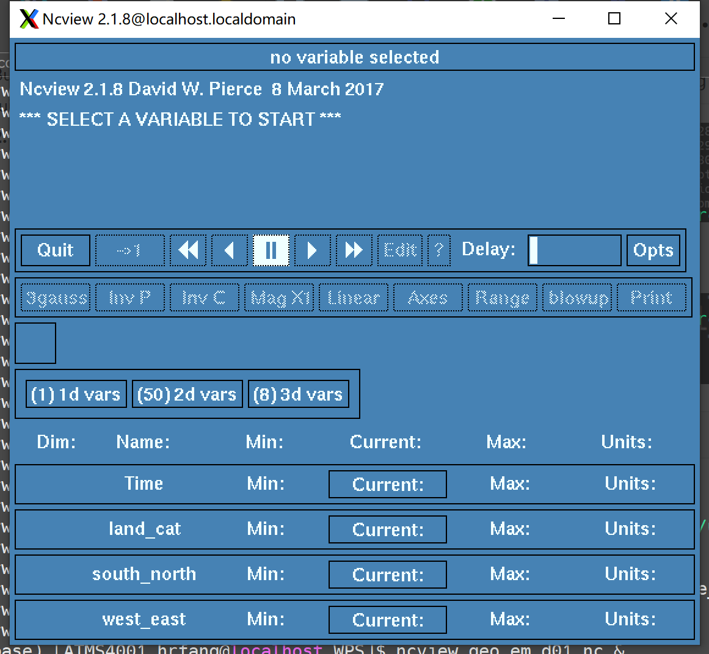

查看2d vars中的HGT_M变量（地形高度）：

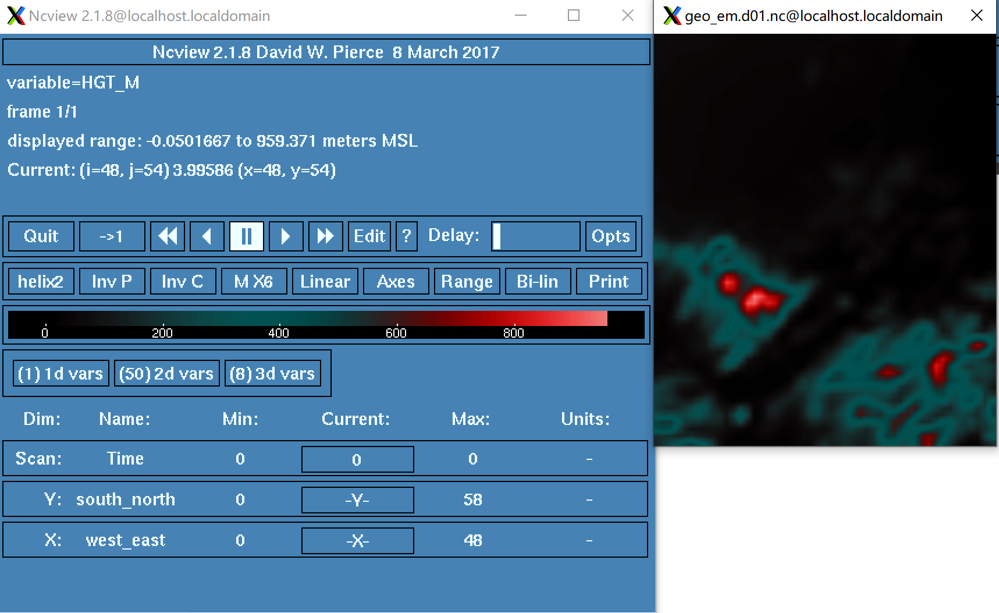

还包括LU_INDEX（陆面类型）：

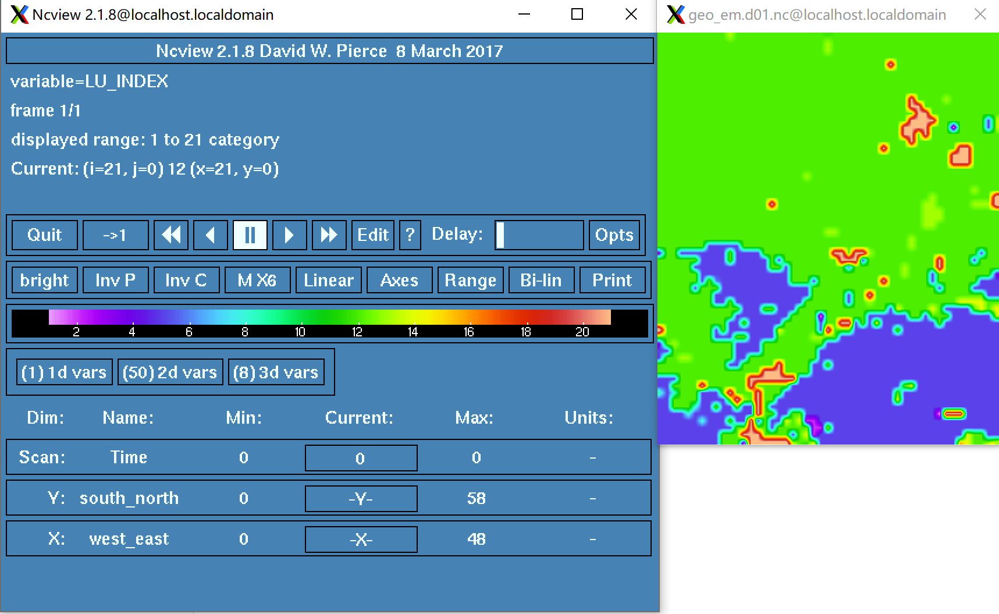

* 尝试不同的分辨率...

### 2.2 About ungrib.exe

```shell
ls -l Vtable	# 查看Vtable链接，会有不同机构的再分析数据
```

对inputdata/做重新链接...FNL*

```shell
./link_grib.csh inputdata/fnl_201808*
```

```shell
vim namelist.wps	# 编排第一块时间对齐...时间插值

./ungrgib.exe >ungrib.log &	# 运行产生ungribdata
```

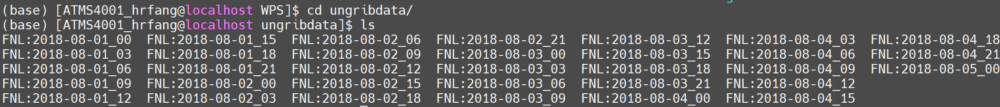

### 2.3 Horizontally interpolating meteorological data with metgrid

```shell
&metgrid
 fg_name = 'ungribdata/FNL'
 io_form_metgrid = 2,
 opt_output_from_metgrid_path='finaldata/'
/

```

```shell
 ./metgrid.exe >& metgrid.log &
```

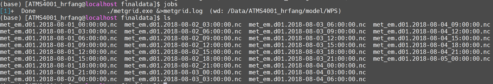

check:

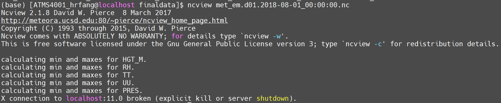

多区域嵌套时比例一般选取奇数倍（3 or 5）

```shell
&share
 wrf_core = 'ARW',
 max_dom = 2,
 start_date = '2018-08-01_00:00:00', '2018-08-01_00:00:00'
 end_date   = '2018-08-05_00:00:00', '2018-08-05_00:00:00'
 interval_seconds = 10800
 io_form_geogrid = 2,
/

&geogrid
 parent_id         =   1, 1
 parent_grid_ratio =   1, 5
 i_parent_start    =   1, 23
 j_parent_start    =   1, 22
 e_we              =  61, 71
 e_sn              =  61, 81

 geog_data_res = 'maxsnowalb_ncep+albedo_ncep+default', 'maxsnowalb_ncep+albedo_ncep+default',
 dx = 10000.0,
 dy = 10000.0,
 map_proj = 'lambert',
 ref_lat   =  31.8,
 ref_lon   =  117.2,
 truelat1 = 45.0 ,
 truelat2 = 45.0,
 stand_lon =  117.2,

```

